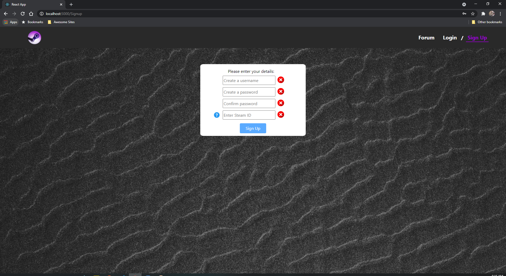
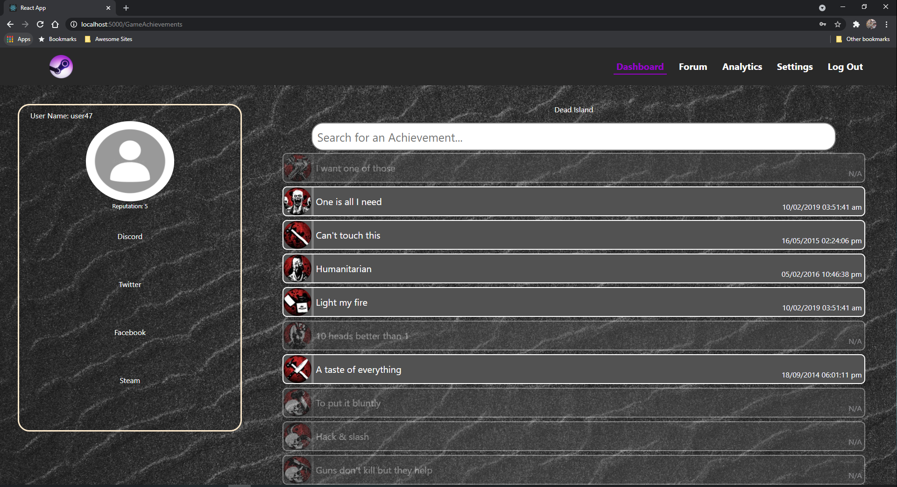

# Steam Achievement Tracker - Team29


## Quick navigation - phase 2
- [In depth tutorial of our web app](#using-our-web-application)
- [Overview of routes](#overview-of-routes)

## Using our web application
1. Our web application can be accessed at -> [https://csc309-team29.herokuapp.com/](https://csc309-team29.herokuapp.com/)  

## Overview of routes
- chat
    1. `GET: {host}/api/chat/:userName/:friendName`, where the userName is the current login user and the friendName is the selected friend name that the user want to chat with. The method willl return a list of messages that the user and the friend has previously chat on.
    2. For Posting messages we use socket.io, so the message will emit to backend and directly interact with mongo at the backend. No route needed.
- friend
    1. `GET: {host}/api/friends/:userName`, where the userName is the current login user. The method will return an object contain the user's friend list and pending friend list. Friend list is the accepted friends that the user has. Pending friend list is the friend that still yet to be accept or reject by the user.
    2. `POST: {host}/api/friends/:userName`, where the userName is the current login user. The method takes in one body argument, which is friendName, the friend's name that the user want to add friend with. The method will push user into friend's pedning friend list await for the friend to either accept or reject. The method will return friend's updated data.
    3. `DELETE: {host}/api/friends/delete`. The method takes in two body argument, which consists of the userName, the current login user, and friendName, the friend's name that the user want to delete. This method will both delete each other from their own friend list. This method will also delete all the chat history that the user and friend has. This method will return the updated user, updated friend, updated chat.
    4. `PATCH: {host}/api/friends/accept`. The method will take in two argument, which consists of userName, the currecnt login user's username, and friendName, the friend' name that user want to accept as a friend. This method will remove friend from user's pending friend list and add to friend list, and also will add user into friend's friend list. This method will also create a new chat room for them with empty messages. This method will return nothing with status 200.
    5. `PATCH: {host}/api/friends/decline`. The method takes in two body argument, which consists of the userName, the current login user, and friendName, the friend's name that the user decline as a friend. This method will remove friend from the user's pending friend list. Ths method will return nothing with status 200. 
- login
    1. `POST {host}/users/changepassword`  
    ```
    Expects:
    Body: {newPassword: string of at least 4 characters}
    cookie: cookie of current logged on user

    Does:
    Changes the password of the current user to the new password
    ```
    2. `GET {host}/users/joindate/:username`
    ```
    Expects:
    nothing

    Does:
    returns the users join date if the user exists, 404 otherwise
    ```
    3. `GET {host}/usernames/:username`
    ```
    Expects:
    nothing

    Does:
    returns 200 if the user exists, 404 otherwise
    ```
    4. `POST {host}/users/login`
    ```
    Expects:
    body: {username: string, password: string}

    Does:
    sets the session parameters and logs you in if the username and password are correct
    ```
    5. `GET {host}/users/current`
    ```
    Expects:
    a logged in user

    Does:
    returns the current users ID and username
    ```
    6. `GET {host}/users/logout`
    ```
    Expects:
    nothing

    Does:
    destroys the session and logs you out
    ```
- profilePic
    1. `GET {host}/api/image/:userName`, where the userName is the current login user. This method will retreive the binary image string from user model and return an object of {image: data}.
    2. `PATCH {host}/api/uploadImage/:userName`, where the userName is the current login user. This method also takes in one body argument, image, which is a binary base64 string converted from an image. This method will update the profilePic from user model. This method will return the updated user object. 
- reputation
    1. `GET {host}/api/user/reputation/:userName`, where the userName is the current login user. The method will retreive the reputation from user model that store on the database and return an object of {reputation: data}.
    2. `PATCH {host}/api/user/updatereputation/:username`, where the userName is the current login user. This method takes in two body argument, which are userName, same as the :userName, and reputation, a Number represent the updated reputation score. The method will update the user on the database and return nothing with a status 200.
- review
    1. `post('/api/reviews')` is used for adding a new review document into the database. It will get all the needed information to create a new review object and return it.
    2. `g`et('/api/reviews')` is used for getting all the reviews in the database. No params will be passed in and it is expected to return a list of review object.
    3. `patch('/api/reviews/:id')` is used for modifying the upvotes, the downvotes, and reported attribute of a specific review in the database. It will get a review json and will return the modified review.
    4. `patch('/api/reviews/:author/:reputation')` is used for modifying the username and the reputation on a specific review in the database. It will get author name and reputation from params and an attribute 'deleted' from req.body, and will return the modified review.
    5. `delete('/api/reviews/:id')` is used for deleting a review by its id. It will get a review id from params and return the review object.
- steam
    1. `GET {host}/steamapi/userinfo`
    ```
    Expects:
    query components: {key: a valid steam API key, steamids: a valid steam user ID}

    Does:
    returns a users user account info
    ```
    2. `GET {host}/steamapi/usergames`
    ```
    Expects:
    a logged in user
    query components: {key: a valid steam API key}

    Does:
    returns a users games info
    ```
    3. `GET {host}/steamapi/games`
    ```
    Expects:
    a logged in user
    query components: {key: a valid steam API key, appid: a valid app ID for a game on steam}

    Does:
    returns the users stats for that particular game
    ```
    4. `GET {host}/steamapi/game`
    ```
    Expects:
    query components: {key: a valid steam API key, appid: a valid app ID for a game on steam}

    Does:
    returns neutral game information about achievements for a specific game
    ```
- user
    1. `get('/api/users')` is used for getting all the users in the database. No params or json will be passed in and it is expected to return a list of user object.
    2. `delete('/api/users/:username', ...)` is used for deleting the user with the username. It will get a username from params and return the user.
- voteRecord
    1. `post('/api/voteRecords')` is used for adding a new vote record for a user on a specific review. It will get a voteRecord json and send the voteRecord document to the database.
    2. `get('/api/voteRecords')` is used for getting all the vote records in the database. No params or json will be passed in and it will return a json of all the vote records.
    3. `patch('/api/voteRecords/:username/:reviewId')` is used for updating the vote of a user on a specific review. It will get a username and a reviewId from params and return the new vote record.
    4. `delete('/api/voteRecords/:username')` is used for deleting all the vote records of a specific user. It will get the username from params and return the vote record.
    5. `delete('/api/voteRecords/:username/:erviewId')` is used for deleting all the vote records of a specific review. It will get the reviewId from params and return the vote record.

## Quick navigation - phase 1
- [Launching the website](#starting-the-app)
- [App walkthrough](#app-walkthrough)
- [Logging in](#login-and-sign-up-pages)
- [Viewing the dashboard](#dashboard)
- [Viewing the forum](#forum)
- [Game acheivements](#game-achievements)
- [Account settings](#account-settings)
- [Administrator page](#admin-page)
- [Game analytics page](#game-analytics)

## Starting the app
1. Clone the app: `git clone git@github.com:csc309-winter-2021/team29.git` or  
`git clone https://github.com/csc309-winter-2021/team29.git`

2. From the root directory(`team29`), simply run `bash start.sh`. This will cd into the directory and run `npm install` and `npm start`.

3. The webpage should open in a browser window. We have tested the webpage in Google Chrome.


## App walkthrough
1. When the app opens at `localhost:3000`, you should see this welcome screen:  


2. From here, you can click on either [Forum](#forum), [Login](#login-and-sign-up-pages), or [Dashboard](#dashboard) to view the different pages.


### Login and Sign up pages
1. The login page should look like this:  


2. Here, you can log in as either an `admin` or `user` (or view parts of the website as a guest without logging in). We have hardcoded the password to be the same as the usernames. So for example, to log in as a user,
you would enter `user` as the username and `user` as the password. We also have a captcha feature to prevent too many requests to the server in phase 2. The login button will be enabled once the captcha has been solved.
If the captcha is not working you can also click the temporary "Bypass verify" button, which we have added for convenience during testing (this button was left in on purpose, so it will be easier for you to navigate around our website).

3. You can also access the sign up page from here, by clicking on the `Sign Up` button, and it should look like this:  


4. For phase 1, this signup page is not functional, since we would need support from the backend to check if a username is unique to create an account. Therefore, right now we have implemented a check to make sure each field is filled in
and that the passwords match. Once those conditions are fulfilled, clicking the `Sign Up` button will display an alert indicating that sign up was successful, but no actual account gets created yet.

5. Once the user is sign in the page, the icon on the navbar will be redirect to dashboard only. Before sign in, the icon will be directed to home.

### Dashboard
1. This is the dashboard page:  


2. Here, you have your user profile on the left with links to various apps that gamers might use. In the middle of the page, you have a progress bar for each game that is on your profile. When you hover on each game, you can select the game and go to [Game acheivements](#game-achievements) and look at the overview of all achievements inside the game. On top of the game, you can also use the search game bar to search the specific game instead of scrolling through. Note that the search bar is updated automatically once you inserted text.

3. You can also click on someone in your friends list to chat with them, note that for phase 1 you can only send chat messages, but not receive any since there is no backend:  


4. Clicking the [Settings](#account-settings) button on the top right hand corner will bring you to the account settings page.

5. You may also click on the [Analytics](#game-analytics) button to view the overall game analytics of your profile.

6. Also note that only admins will have an "Admin" button show up in the navbar that leads to the admin page.


### Forum
1. The forum is a place where you can leave reviews for games, it shows the most recent reviews on the games that are on the site:


2. Here you can add a review if you are logged in, and upvote or downvote a review. Added reviews can be viewed by clicking on the `next` button to see the next page.


### Game achievements
1. The game achievements page will look like this:  


2. Here, the achievement that are less visible will be the lock achievements, and the one that is visible will be the unlock achievement that the user have.

3. You can also use the search bar to search for specific achievement that the game have.

4. To redirect back to dashboard, simply click on the icon in the navbar.


### Account settings
1. The account settings page looks like this:  


2. From here, you can edit the specifics of your profile, like uploading a new profile picture (though saving it to your profile is currently not functional as we need the backend for that), or changing some of your gaming social media handles using the edit buttons for the relevant fields.


### Admin page
1. The admin page looks like this:  


2. From this page, you can do things like delete or edit reviews, and also delete or ban users. You also must be logged in as an admin to access this page.


### Game Analytics
1. The game analytics page looks like this:  


2. From here, you can view useful and interesting statistics about your game play such as your overall repuation score, total achievements unlocked, completion percentage, and total playtime in the banner at the top of the page. You can also view a breakdown of your statistics by each individual game the Lifetime Statistics table at the bottom of the page. You can also sort the table in ascending or descending order by each column using the arrow buttons on each column's header.
