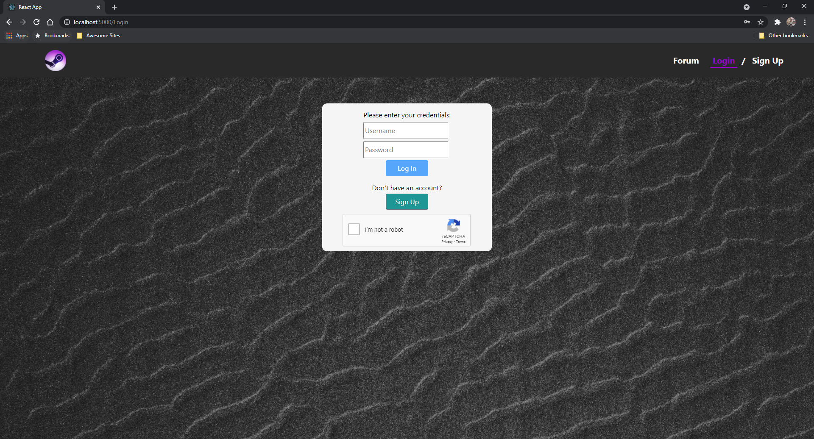
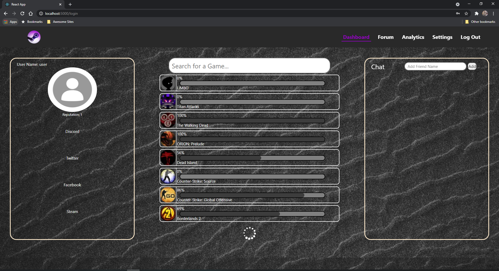

# Steam Achievement Tracker - Team29

## Quick navigation
- [Launching the website](#starting-the-app)
- [App walkthrough](#app-walkthrough)
- [Logging in](#login-and-sign-up-pages)
- [Viewing the dashboard](#dashboard)
- [Viewing the forum](#forum)
- [Game acheivements](#game-achievements)
- [Account settings](#account-settings)
- [Administrator page](#admin-page)
- [Game analytics page](#game-analytics)

## Starting the app
1. Clone the app: `git clone git@github.com:csc309-winter-2021/team29.git` or  
`git clone https://github.com/csc309-winter-2021/team29.git`

2. From the root directory(`team29`), simply run `sh start.sh`. This will cd into the directory and run `npm install` and `npm start`.

3. The webpage should open in a browser window. We have tested the webpage in Google Chrome.

## App walkthrough
1. When the app opens at `localhost:3000`, you should see this welcome screen:  

2. From here, you can click on either [Forum](#forum), [Login](#login-and-sign-up-pages), or [Dashboard](#dashboard) to view the different pages.

### Login and Sign up pages
1. The login page should look like this:  

2. Here, you can log in as either an `admin` or `user` (or view parts of the website as a guest without logging in). We have hardcoded the password to be the same as the usernames. So for example, to log in as a user,
you would enter `user` as the username and `user` as the password. We also have a captcha feature to prevent too many requests to the server in phase 2. The login button will be enabled once the captcha has been solved.
If the captcha is not working you can also click the temporary "Bypass verify" button, which we have added for convenience during testing (this button was left in on purpose, so it will be easier for you to navigate around our website).

3. You can also access the sign up page from here, by clicking on the `Sign Up` button, and it should look like this:  

4. For phase 1, this signup page is not functional, since we would need support from the backend to check if a username is unique to create an account. Therefore, right now we have implemented a check to make sure each field is filled in
and that the passwords match. Once those conditions are fulfilled, clicking the `Sign Up` button will display an alert indicating that sign up was successful, but no actual account gets created yet.

5. Once the user is sign in the page, the icon on the navbar will be redirect to dashboard only. Before sign in, the icon will be directed to home.

### Dashboard
1. This is the dashboard page:  

2. Here, you have your user profile on the left with links to various apps that gamers might use. In the middle of the page, you have a progress bar for each game that is on your profile. When you hover on each game, you can select the game and go to [Game acheivements](#game-achievements) and look at the overview of all achievements inside the game. On top of the game, you can also use the search game bar to search the specific game instead of scrolling through. Note that the search bar is updated automatically once you inserted text.

3. You can also click on someone in your friends list to chat with them, note that for phase 1 you can only send chat messages, but not receive any since there is no backend:  

4. Clicking the [Settings](#account-settings) button on the top right hand corner will bring you to the account settings page.

5. You may also click on the [Analytics](#game-analytics) button to view the overall game analytics of your profile.

6. Also note that only admins will have an "Admin" button show up in the navbar that leads to the admin page.

### Forum
1. The forum is a place where you can leave reviews for games, it shows the most recent reviews on the games that are on the site:

2. Here you can add a review if you are logged in, and upvote or downvote a review. Added reviews can be viewed by clicking on the `next` button to see the next page.

### Game achievements
1. The game achievements page will look like this:  

2. Here, the achievement that are less visible will be the lock achievements, and the one that is visible will be the unlock achievement that the user have.

3. You can also use the search bar to search for specific achievement that the game have.

4. To redirect back to dashboard, simply click on the icon in the navbar.

### Account settings
1. The account settings page looks like this:  

2. From here, you can edit the specifics of your profile, like uploading a new profile picture (though saving it to your profile is currently not functional as we need the backend for that), or changing some of your gaming social media handles using the edit buttons for the relevant fields.

### Admin page
1. The admin page looks like this:  

2. From this page, you can do things like delete or edit reviews, and also delete or ban users. You also must be logged in as an admin to access this page.

### Game Analytics
1. The game analytics page looks like this:  

2. From here, you can view useful and interesting statistics about your game play such as your overall repuation score, total achievements unlocked, completion percentage, and total playtime in the banner at the top of the page. You can also view a breakdown of your statistics by each individual game the Lifetime Statistics table at the bottom of the page. You can also sort the table in ascending or descending order by each column using the arrow buttons on each column's header.
